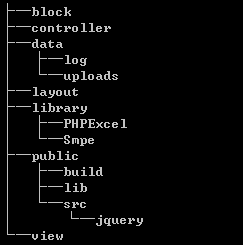

##### Smpe概述

Smpe是参照MVC模式设计的简单高性能PHP应用程序框架. 解决中大型项目混乱的开发和维护过程. 参考了Drupal,CI,Zend Framework的优点, 结合实际项目开发过程设计的简单高性能应用框架.

基于Smpe开发项目的目录结构通常是这样的:

下面是第一层目录的详细说明:

  * **block**: 存储视图区块;
  * **controller**: 存储控制器;
  * **data**: 存储日志或上传文件, 此目录需要赋予写入权限;
  * **layout**: 存储视图布局文件的目录;
  * **library**: 这里存储各种PHP类库文件, 从上图中可以看出, Smpe和PHPExcel一样, 作为一个类库占据一个目录. 从这里看出Smpe并不排斥其他类库;
  * **public**: 这是公共目录, 通常将Nginx或Apache的根目录指向这里, 这里也存储图片,js,css等静态资源文件;
  * **view**: 存储视图文件;

Smpe暂不提供自定义路由的功能, 采用严格一致的路由匹配. 如果需要简洁的URL地址, 可通过配置Nginx或Apache的重写规则实现.

基于Smpe框架的应用开发首先要做的事情是模块的划分. 正确的模块规划非常重要.

##### Smpe的约束

  * 严格的路由
  * URL地址有Smpe_Url类来构建
  * 99%的SQL由ORM构建
  * 模块第一

已经了解了目录结构, 下面通过一个简单的实例来进一步了解Smpe的功能. 

[<<Smpe开发者文档](README.md)
[[目录](README.md)]
[第一个Smpe应用程序>>](1.md)
